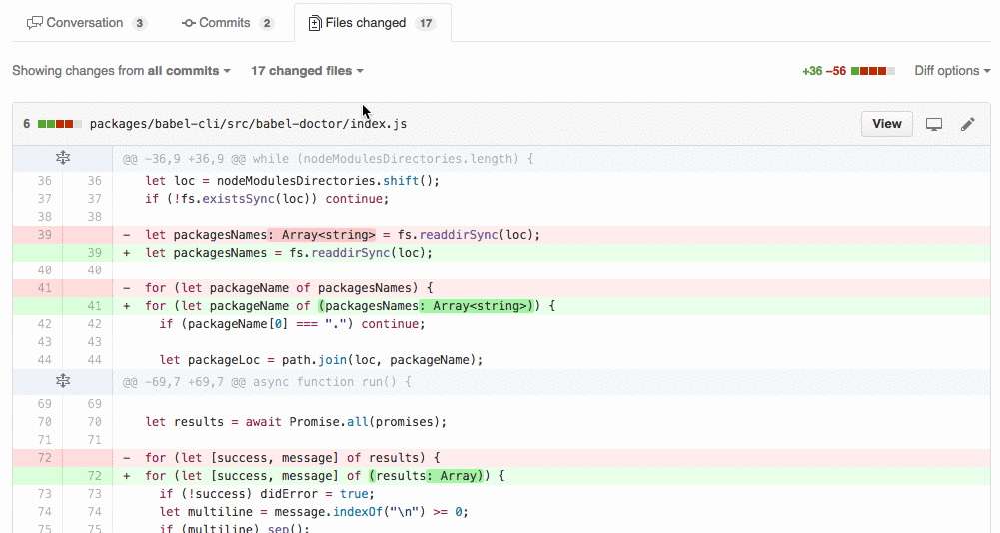

# PR file filter for Github
This Chrome extension extends the file search of a pull request to allow for actual filtering with globs.

## Examples

**Path:**
- `src/test/resources/templates/files/DashboardTest.json`

Patterns:
- `**/templates/**/*.json`
- `**/templates/**/*Test.json`

**Path:**
- `src/test/java/com/company/project/handlebars/config/HandlebarsConfigTest.java`

Pattern:
- `**/handlebars/**/*test.java`

**Path:**
- `src/main/java/com/company/project/domain/AbstractProjectContext.java`

Pattern:
- `!*.js?(on)` (Exclude .js and .json files from results)
- `**/*Project*.java`

## Bug reports and feedback
If you experience any problems while using the file filter feel free to create an issue. It is extremly helpful to include 1. the file paths you tried to search against and 2. the pattern you used for searching as well as the expected results. When possible link the related PR (in case it is a public repository)

Copyright (c) 2016 [Sammy Braun](https://github.com/siggysamson)

## ToDo
- Write tests!
